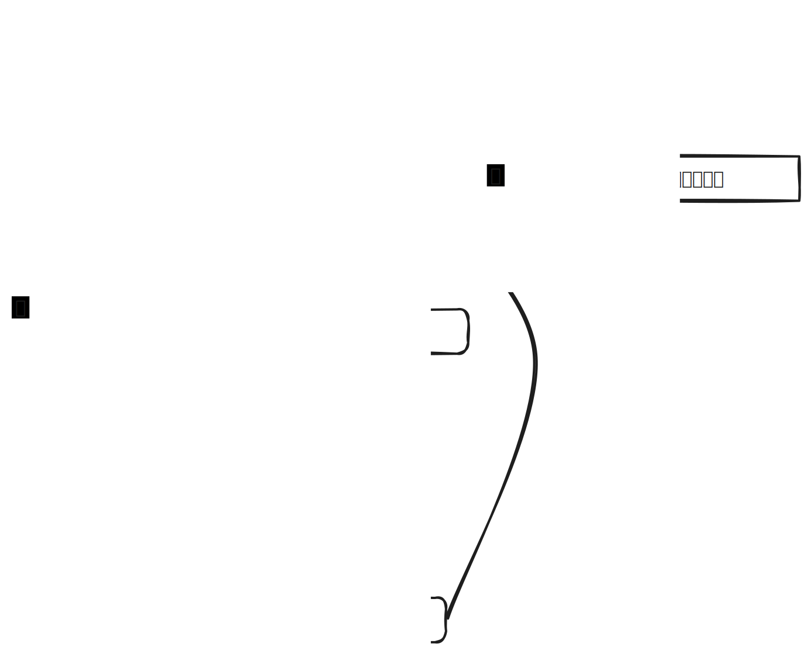
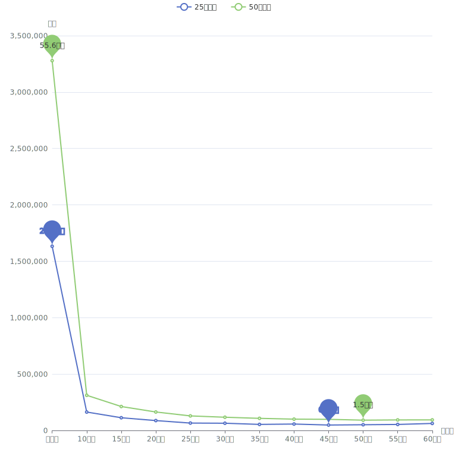
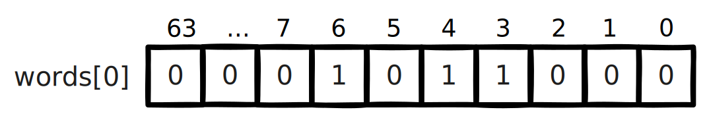
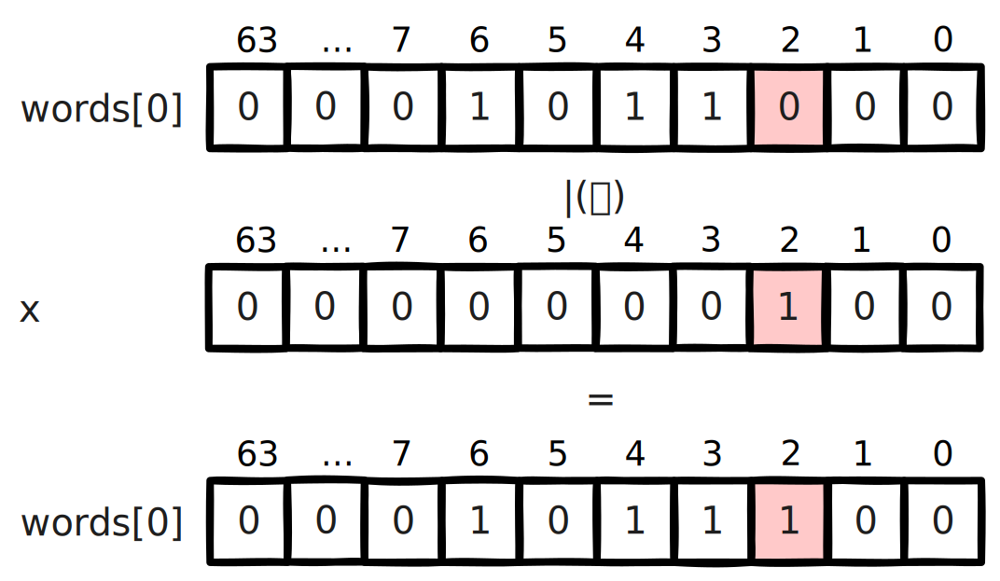
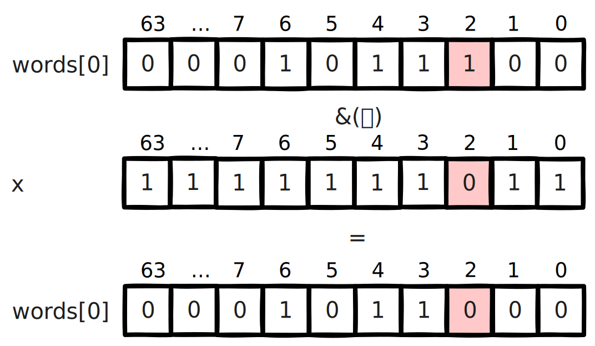
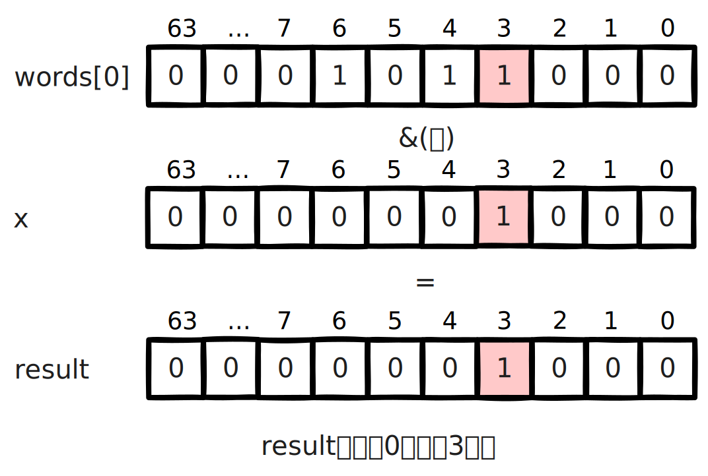
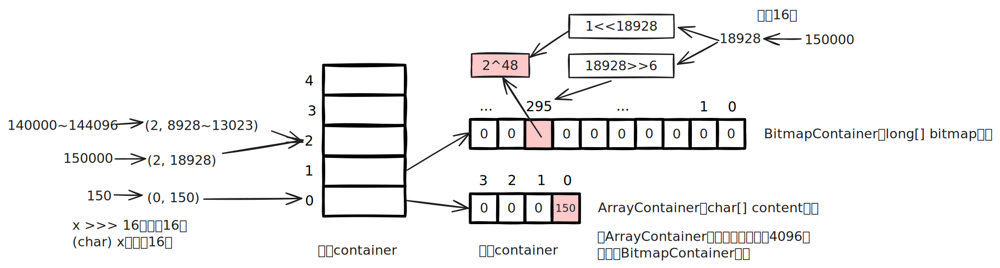
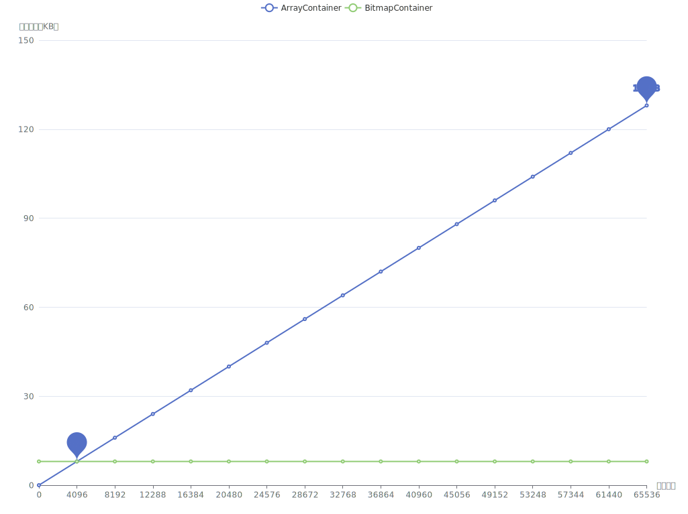

# 背景

营销系统中，客户投诉是业务发展的一大阻碍，一般会过滤掉黑名单高风险账号，并配合频控策略，来减少客诉，进而增加营销效率，减少营销成本，提升营销质量。

营销系统一般是通过大数据分析建模，在CDP（客户数据平台，以客户为核心，围绕数据融合、人群圈选、用户洞察等提供产品能力）创建营销目标客户群体，黑名单同样也是通过CDP维护。下面的图片简单描述了过滤黑名单的处理流程，流程是相对简单的。但是，测试过程中却发现一个问题，对于一个近30万的营销群体，整个触达流程需要处理一个多小时，而其中过滤黑名单就占用了近半个小时的时间，业务有点难以接受这个性能。



# 性能优化
## 引入多线程优化

其实很容易就能想到，对于调用RPC接口这种含有I/O操作的场景，可以引入多线程优化，将一个几十万的账号集合拆分为多个子任务提交给线程池处理，从而加快处理速度。从下图可以看出引入多线程后性能有很明显的改善，单线程处理25万、50万个账号的群体分别需要近半小时、近一小时，改为25个线程处理后可以分别控制在1分钟、2分钟左右。



## 引入位图优化

进一步了解CDP的底层原理后，会发现这个问题应该还有其他的解决方案，即通过位图优化。CDP的群体都会有对应的位图文件，也就是说营销客户群体和黑名单群体都是以位图的数据结构存储的，通过CDP下载群体的SDK就可以获取到位图文件，营销群体的位图与黑名单群体位图进行与非操作（`andNot`，就是从一个位图中移除另一个位图中存在的元素，而保留不在另一个位图中的元素），得到的新的位图就是过滤掉黑名单账号后的目标客户的位图。代码实现很简单，使用CDP SDK的示例代码如下（也可以参考[GitHub](https://github.com/howiefh/bitmap-example/blob/main/src/main/java/io/github/howiefh/bitmap/BitmapBlacklistOptimize.java)示例代码，但不适用于CDP群体位图处理）：

```java
DataLoader dataLoader = new DataLoader(token, bitMapBaseUrl);
ABitmap customerBitmap = dataLoader.loadGroup(customerGroupCode);
ABitmap blacklistBitmap = dataLoader.loadGroup(blacklistGroupCode);
customerBitmap.andNot(blacklistBitmap);
```

位图存储相当节省空间，50万群体的位图文件也就约2MB大小。同时位图的与非操作是相当快的，上边例子中的25万、50万的群体都可以在80毫秒左右过滤掉黑名单账号。从近半小时、近一小时到几十毫秒这个对比非常惊人了，那么为什么位图的处理速度可以这么快呢？

# 位图简介
## 位图原理

位图的基本思想是使用bit来标记一个数值，1表示该数值存在，0表示不存在。由于以位为单位存储数据，因此可以大大节省存储空间。通过这种方式，可以非常高效地表示和操作数值集合。

举个直观的例子，有40亿个不重复的随机自然数，如果使用`long`型数值存储，一个`long` 型数值8个字节，40亿个数值占用约29.8GB，但如果是存储为40亿个bit，则只需要约0.47GB。

在Java中一个`long`型数值占64位，可以用一个`long`型数组 `long[] words = new long[(nBits - 1) / 64 + 1]` 存储位图，其中`nBits`表示位图的初始大小。对于给定任意自然数`x`，`x / 64`就能得到`x`在数组中的下标，`x % 64`就能得到`x`在此下标的哪个位。数组的第一个下标 `words[0]` 可以表示数值`0~63`，第二个下标 `words[1]` 可以表示数值`64~127`，之后依此类推。

如果将 3, 4, 6 几个数值存入位图，则如下图所示，对应数组的第一个下标的 3, 4, 6 位被标记为1，其他位均为0。



对于添加操作，假设要添加数值`2`，可以计算出其在数组中的下标为`2 / 64`即`0`，在`words[0]`的位置为`2 % 64`即 `2`，只需将`1`按位左移`2`位，然后和`words[0]`进行按位或操作，将相应位置置为`1`。



对于移除操作，假设要移除刚添加的数值`2`，和添加操作一样，可以通过计算得到其在数组的下标为`0`, 在`words[0]`的位置为 `2`，只需将`1`按位左移`2`位再按位取反，然后和`words[0]`进行按位与操作，将相应位置置为`0`。



而对于查找操作，假设要查找数值`3`，可以计算得到其在数组的下标为`0`, 在`words[0]`的位置为 `3`，只需将`1`按位左移`3`位，然后和`words[0]`按位与操作不等于`0`即可判断数值是否存在。



以上内容简单介绍了 Java 中的 `BitSet` 的实现原理，实际代码还会稍微复杂一些，比如会涉及到数组扩容，范围边界的检测等等。有意思的是`BitSet`中计算数组下标和位置并没有使用除法和取模，都是通过位移操作实现的，`x / 64` 是通过右移操作 `x >> 6`，`1`按位左移`x % 64`位是直接将`1`左移`x`位即`1 << x`。

位图对象还支持一些常用的位运算，如求交集(`and`, 按位与操作)，求并集(`or`, 按位或操作)，求差集(`andNot`, 按位与非操作)。

位图非常节省存储空间，位操作也非常高效，这也是为什么引入位图过滤黑名单能在毫秒级别处理完成的原因。

## RoaringBitmap

遗憾的是，`BitSet`会占用过多内存。如果`BitSet`中只存储一个数值 `200000000`，通过GraphLayout发现`BitSet`会占用约23MB内存，这种情况对空间的浪费极其严重。为了弥补这一缺陷，通常使用压缩位图。

`RoaringBitmap`是一种压缩位图，其性能往往优于 `WAH`、`EWAH` 或 `Concise` 等传统压缩位图。在某些情况下，`RoaringBitmap`的速度可以快上数百倍，而且压缩效果往往要好得多。它们甚至比未压缩的位图更快。如果使用`RoaringBitmap`只存储一个数值 `200000000`，只需要144B的内存。

`RoaringBitmap`将一个`int`数值`x`划分为高16位和低16位，高16位下标可以通过`x >>> 16`得到，高位container中维护了一个数组，数组的元素中存储了低位container，低位container中的元素数量未达到4096时，使用`ArrayContainer`存储，其内部实现是一个`char`数组，数组中存放低位数值，达到4096后低位container会转换为`BitmapContainer`，其内部实现就是一个位图。此外还有一个`RunContainer`的实现，不过较少使用。



为什么要使用4096这个阈值呢？是因为超过4096后，`BitmapContainer`会比`ArrayContainer`更节省空间。



存储 `long`型数值时可以使用`Roaring64NavigableMap`，区别是它会将数值分为高32位和低32位。CDP存储人群的位图就是基于`Roaring64NavigableMap`实现的。

# 位图的应用场景

位图可以用较少的内存来表示大规模的布尔值集合，节省内存空间，并且支持高效的位操作，如 `AND`、`OR`、`XOR` 等，使得对集合进行复杂操作变得简单高效，对于存在性查询，位图可以在常数时间内完成，具有高效的查询性能。一些面试题中出现的几十亿数据的去重、排序、计数或者成员查询等问题，都可以通过位图解决，此外还有很多场景应用到了位图。

## Java 中的位图应用

`ArrayList`为了提升性能并节省空间，重写了`Collection`接口默认的`removeIf`方法，重写后的方法使用了位图，首先遍历一遍元素用位图标记待删除的元素位置，然后遍历第二遍才真正删除元素，通过这种方式实现，可以高效移除元素，减少不必要的数组复制和元素移动次数，并且使用位图标记待删除位置也没有过多浪费空间。

## 位图索引

位图索引是一种特别适合于处理具有较少唯一值的列（例如性别、婚姻状况等）查询的数据结构，它在数据仓库等场合中非常有用，因为这些环境通常包含大量的数据读取操作和复杂的布尔逻辑查询，同时数据更新的频率相对较低。位图索引通过将列值映射到位上，并利用位运算来快速完成查询，能够有效提高查询效率，但它不适合那些具有高基数值和频繁更新的场景，因为这些场景下位图索引会占用大量空间并且更新成本很高。

## Redis 的位图

Redis的位图非常适合于处理大量的布尔值数据，例如追踪用户的在线状态、记录用户每日签到或统计活跃用户数量等场景，因为位图通过每个位代表一个布尔值，可以极大地节省存储空间，并且Redis提供了丰富的位操作命令来高效地执行各种计算，如统计特定位上值为1的数量或者对多个位图进行位运算以实现快速的集合操作，这些特性使得位图在特征标记、实验分组以及AB测试等方面也非常有用；但是，需要注意的是，由于Redis将位图存储为字符串，因此其大小会受到字符串最大长度的限制，并且当数据量巨大时，对内存的使用效率也是一个需要考虑的因素。

## 布隆过滤器

数值可以很方便地使用位图处理，但是有些场景需要处理的可能是字符串，比如用户账号、URL等，一般需要将字符串跟数值做一个映射，CDP是将用户账号和偏移量offset做了一个映射表，再将偏移量offset存储到位图。布隆过滤器则是通过多个哈希函数将元素映射到了位图上，它是一种空间效率极高的概率型数据结构，它用于判断一个元素是否在一个集合中，并且能够非常快速地进行查询，常见的应用场景包括网络爬虫中避免重复爬取相同的URL、数据库中快速判断某个元素是否存在以减少不必要的磁盘IO操作、防止缓存击穿，以及各种需要快速集合检测且可以容忍一定误报率的场合，误报是指布隆过滤器可能会错误地判断某个不存在集合中的元素为存在，但它绝不会错误地判断存在的元素为不存在，因此在不需要百分之百准确性的情况下，布隆过滤器是一种非常有用的工具。

# 总结

通过探讨营销系统中优化黑名单过滤的策略，本文引入了位图这一数据结构，并详细阐述了其背后的实现机制及适用场合。位图特别适用于那些对空间效率和查询速度有极高要求的场景。在处理大数据时，位图通过压缩和优化可以极大地减少内存占用，提升数据处理的性能，希望本文能为大家提供有益的参考和帮助。
